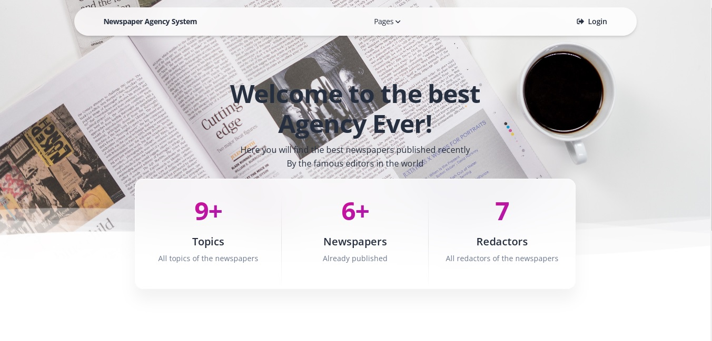

# Newspaper Agency Project

Django project for managing newspapers and redactors in Agency

## Check it out!
_________________

## Installation

Python3 must be already installed

```shell
git clone https://github.com/sasha-semenenko/newspaper-agency.git
cd newspaper-agency
python3 -m venv venv
venv\Scripts\activate
pip install -r requirements.txt
python manage.py runserver # Starts Django Server
```

## Features

* Authentication functionality for Redactor/User
* Managing newspapers redactors & topics directly from website
* Powerful admin panel for advanced managing

## Demo

